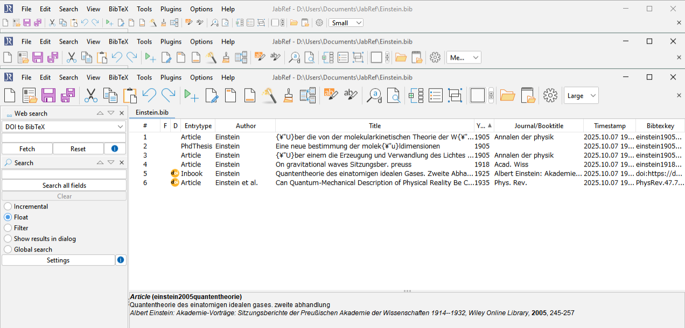
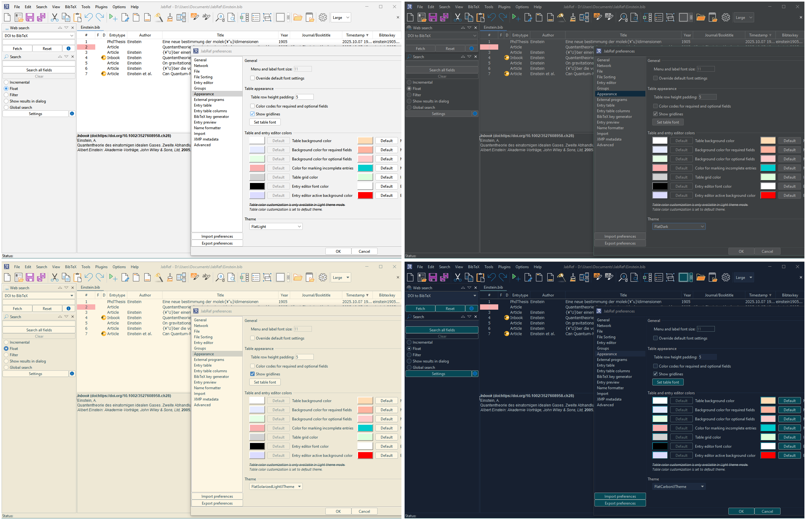

## JabRef 2.x FlatLafed (Experimental Fork)

This is an experimental fork of JabRef 2.11, aiming to modernize the legacy Swing-based codebase while retaining compatibility and simplicity.

---

### Background

[JabRef](https://github.com/JabRef/jabref) is a widely used, open-source bibliography manager.  
Originally built with Swing, the project later migrated to JavaFX in later versions.

While the classic 2.x line is stable and lean, it suffers from limitations on modern high-DPI displays.  
In particular, toolbar icons in the 2.x branch are hard-coded PNGs of fixed size, resulting in suboptimal appearance on high-resolution screens.  
This fork seeks to mitigate that.

---

### Goals & Features

#### Main changes

- **FlatLaf integration** for improved theming and HiDPI scalability via [FlatLaf GitHub](https://github.com/JFormDesigner/FlatLaf)  
- **Toolbar icon scaling control** — add a toolbar button to toggle icon sizes: Small (16×16), Medium (24×24), Large (32×32)  
- **SVG icon usage** — replace all toolbar icons with the LibreOffice SVG icon set  
- **New themes** (via FlatLaf):  
  - FlatLight  
  - FlatDark  
  - FlatSolarizedLight IJTheme  
  - FlatCarbon IJTheme  

#### Technical / minor enhancements

- Replaced `Vector` with `ArrayList` and added caching mechanisms to speed file load & parsing  
- Resolved Java type warnings and other compiler-level issues  
- Fixed problems in arXiv and DOI search integration  

---

### Screenshots

#### Toolbar size options  

#### Theme previews  

---

### Status & Caveats

This project is **experimental** and not intended to fully replace modern JabRef releases.  
It is best suited for scenarios where you prefer a lightweight Swing-based tool with improved DPI support.

---

### License

This fork retains the GNU GPL v2 license, consistent with the original JabRef 2.x licensing.

---

### Credits & References

- Original JabRef project: **JabRef / jabref** on GitHub — https://github.com/JabRef/jabref
- Look & Feel library: **FlatLaf** on GitHub — https://github.com/JFormDesigner/FlatLaf
- **LibreOffice** icon set (SVG icons) on GitHub — https://github.com/LibreOffice/core